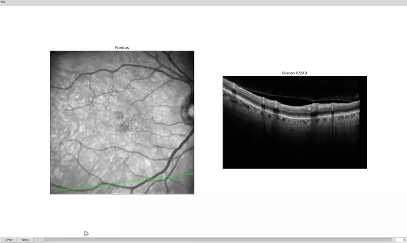

# OCT E2E Viewer

A small desktop app for scrolling through the B-scans of a Heidelberg Heyex `.E2E` OCT file, one slice at a time, with the current slice's position marked on the en-face fundus image. Built on [eyepy](https://github.com/MedVisBonn/eyepy) for reading `.E2E` files and Tkinter for the UI.



## Install

The easiest way to install is with [pipx](https://pipx.pypa.io/), which puts the app in its own isolated environment and puts the `oct-e2e-viewer` command on your PATH, without you needing to create or activate anything:

```bash
pipx install git+https://github.com/MakrisJr/oct-e2e-viewer.git
```

(Install pipx itself first if you don't have it: `python3 -m pip install --user pipx && python3 -m pipx ensurepath`.)

If you're developing on the code instead, use an editable install in a venv (or conda env) of your own:

```bash
python3 -m venv .venv
source .venv/bin/activate
pip install -e .
```

Either way, this installs the `oct-e2e-viewer` command and the `oct_e2e_viewer` package.

> **Note:** the UI uses Tkinter, which is part of the Python standard library but not always bundled by default. On Debian/Ubuntu, install it with `sudo apt install python3-tk` if you get a `No module named 'tkinter'` error.

## Run

```bash
oct-e2e-viewer                     # opens with File > Open
oct-e2e-viewer path/to/scan.e2e    # opens a file directly
```

## Controls

- Left/Right arrow keys, mouse scroll wheel, the slider, or Prev/Next buttons: step through B-scans.
- Page Up/Page Down: jump 10 slices at a time.
- Type an index in the box and press Enter to jump directly to it.
- `Ctrl+O`: open a file. `Ctrl+Q`: quit.

## Double-click to open (Linux)

To make double-clicking a `.e2e`/`.E2E` file in your file manager open it in this app:

```bash
oct-e2e-viewer --install-desktop-entry
```

This works regardless of how you installed (pipx or an editable venv/conda install) and doesn't require a local checkout of this repo -- just run it with `oct-e2e-viewer` on `PATH` (or from *within* the venv/conda env you installed into). It registers a MIME type for `.e2e`/`.E2E` files, installs a `.desktop` launcher (with icon) under `~/.local/share/applications`, and sets it as the default handler via `xdg-mime`. It's a user-level install (no sudo).

## Project layout

```text
src/oct_e2e_viewer/
    loader.py               # thin wrapper around eyepy's import_heyex_e2e
    app.py                  # Tkinter UI
    desktop_integration.py  # `--install-desktop-entry` (Linux launcher + MIME type)
    resources/              # icon, .desktop template, MIME type definition
```
